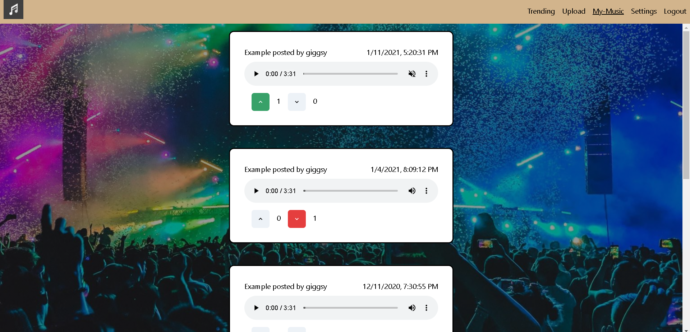
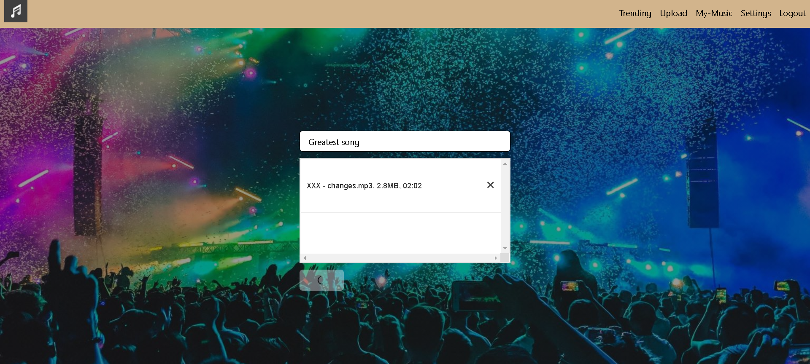

<h1>MusicHub-Plus</h1>

Full stack music sharing application that allows users to share and download audio files across the browser. 
Created using TypeScript, Next.js, Redis, GraphQL, and PostgreSQL. Styled using Chakra UI. 

<h3>Synopsis</h3>
This application was my second attempt at a music sharing application. 
My first iteration was great learning experience, but it was far from perfect.
I decided to use a new tech stack to make sure I wouldn't make the same mistakes again.

<h3>Tech Stack</h3>

I chose to use TypeScript for a better development experience over JavaScript.

The next choice I had to make was between React.js and Next.js. However, Next.js
is a lot better for server side rendering and optimizing the application for the
search engine, and was my final choice. 

Even though the previous iteration used MongoDB,
I used PostgreSQL which is more performant.

I opted out of using REST API, and using GraphQL because it's a lot more flexible
in how it can query data.

As for persisting user data, I used redis, a server side cache, as opposed to a 
client side cache, which people can manipulate on the browser.

<h3>Screenshots </h3>

    
Check out new music!

    

    
Upload new songs!

    

